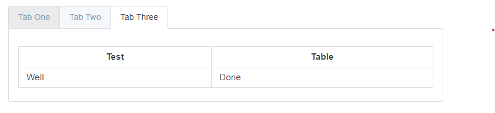

# Markdown-Tabs for Honkit



## Usage

```markdown
<!-- tabs:start -->
## Tab One

Tab One Content

## Tab Two

Tab Two Content

## Tab Three

| Test | Table |
| ---- | ----- |
| Well | Done  |
<!-- tabs:end -->
```
